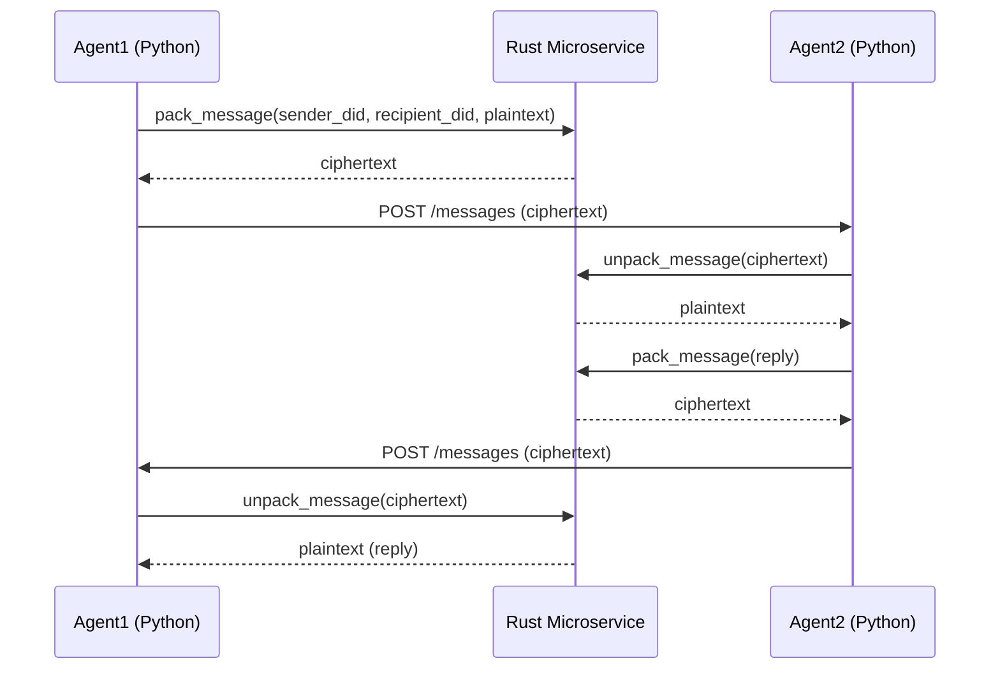

```mermaid
sequenceDiagram
    participant A1 as Agent1 (Python)
    participant R as Rust Microservice
    participant A2 as Agent2 (Python)

    A1->>R: pack_message(sender_did, recipient_did, plaintext)
    R-->>A1: ciphertext
    A1->>A2: POST /messages (ciphertext)

    A2->>R: unpack_message(ciphertext)
    R-->>A2: plaintext
    A2->>R: pack_message(reply)
    R-->>A2: ciphertext
    A2->>A1: POST /messages (ciphertext)

    A1->>R: unpack_message(ciphertext)
    R-->>A1: plaintext (reply)
```
